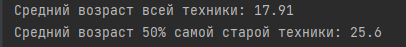

# Проект V1. Задание – ООО "Травка - муравка"

## Оглавление
[1. Описание проекта](README.md#Описание-проекта) 
[2. Входные данные](README.md#Входные-данные)  
[3. Как решал?](README.md#Как-решал?)    
[4. Результаты](README.md#Результаты)  
[5. Выводы](README.md#Выводы)

### Описание проекта
Скрипт для поиска среднего возраста техники на языке Dart

### Входные данные
Два словаря с данными о технике

### Как решал?
Задача разделена на несколько этапов:
1) Извлечение стартовых данных;
2) Занесение уникальной техники в словарь;
3) Вычесление среднего возраста;
4) Вычесление среднего возраста 50% самой старой техники

### Результаты

### Вывод:

К конце можно можно сделать небольшой вывод:

✅ Поставленный кейс выполнил;
 ✅ Были закреплены полученные знания;